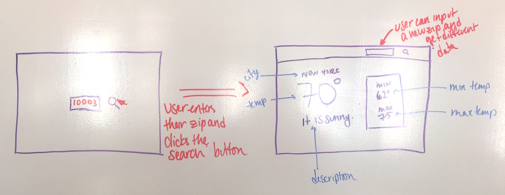

| Title | Type | Duration | Author |
| -- | -- | -- | -- |
| Open Weather API | Lab | 1:30 | Rachel Moskowitz (adapted from SEI) |


#  Building a Weather App

Here's an exciting challenge: You'll be building a small weather app using your newfound API skills.

## Set Up

#### 🚀 Make sure to follow all of these steps:

1. Sign up for a free [OpenWeatherMap](https://home.openweathermap.org/users/sign_up) account.
2. Once you've signed up, you'll be given an [API key](https://home.openweathermap.org/api_keys). Copy that API key and store it somewhere safe.
3. Open Postman to check out the data you're working with and verify that your key works. Create a `GET` request to the URL below in Postman, adding your API key to the end:

```
http://api.openweathermap.org/data/2.5/weather?q=New+York&units=imperial&appid=[PUT YOUR API KEY HERE]
```

**You'll be working with `index.html`, `main.js`, and `style/style.css`.**

## Your Weather App

In the end, your weather app should look something like this:



## Your Page

Your page should have:
- An input field for a user to enter a zip code.
- A `Submit` button.
    - When the `Submit` button is clicked:
        - A `GET` request should fetch the weather data from the API.
        - The following data should be rendered on the page:
            - City name
            - Current temperature
            - Weather description
            - Min temp
            - Max temp
- The temperature turn blue if below 40 and red if above 90.

Here are some zip codes to test:
- 99501 (Anchorage)
- 99723 (Barrow, AK)
- 60605 (Chicago)
- 70124 (New Orleans)
- 77030 (Houston, TX)
- 00902 (San Juan, Puerto Rico)
- 46923 (Delphi, IN)
- 94123 (San Francisco, CA)

## Bonus

- Add the latitude and longitude, humidity, precipitation, and wind speed.
- Add Font Awesome icons.
- Add sunrise and sunset times (look into the [JavaScript `Date` object](https://developer.mozilla.org/en-US/docs/Web/JavaScript/Reference/Global_Objects/Date)).
